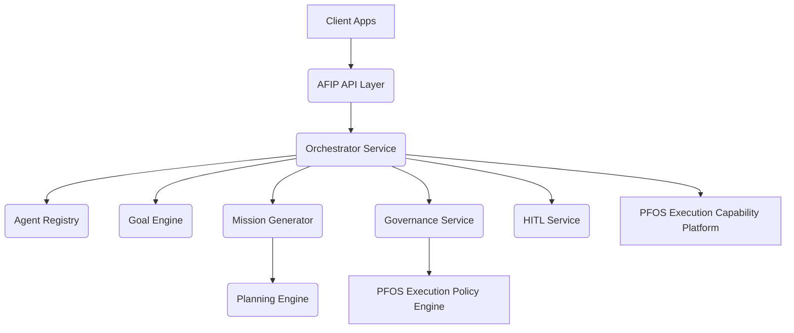

# Enterprise Autonomous Financial Intelligence Platform (Phase 12)

## Overview
The Autonomous Financial Intelligence Platform (AFIP) serves as the operational intelligence layer for the Personal Financial Operating System (PFOS). It is a multi-agent orchestration platform designed to securely coordinate specialized agents towards user financial goals.

## Core Modules
1. **Agent Registry**: Manages autonomous agents, their roles, capabilities, and governance policies.
2. **Multi-Agent Orchestrator**: Coordinates workflows (sequential and parallel) and delegates tasks using consensus patterns.
3. **Goal Engine**: Tracks and manages dynamic financial goals (e.g. Emergency Fund, Debt Reduction).
4. **Planning Engine**: Translates goals into daily/weekly/annual horizons.
5. **Mission Generator**: Assembles specific executable missions.
6. **Agent Memory**: Avoids independent memory stores by persisting memory pointers to the global PFOS Knowledge Graph.
7. **Human-in-the-Loop (HITL)**: Defines classifications (Inform, Recommend, Require Approval) to ensure safety.
8. **Agent Collaboration**: Facilitates delegation and task negotiation.
9. **Agent Governance**: Plugs into the existing PFOS Execution Policy Engine for continuous policy enforcement.
10. **Agent Evaluation**: Produces scorecards tracking agent success, latency, cost, and trust scores.

## Architecture

## Security & Governance
AFIP agents do not possess direct access to user funds or ledgers outside of the Platform SDKs. Every proposed action is intercepted by the `GovernanceService`, which delegates policy evaluation to the PFOS Execution Policy Engine. Only after explicit approval (if required by `HITLService`) are tasks sent to the execution capabilities.

## Extensibility
The platform is built with future MCP (Model Context Protocol) and A2A protocols in mind. The `Agent` model supports versioning, dynamic tool schemas, and dependency mapping to ease onboarding of new tools or even regulated advisor agents.
